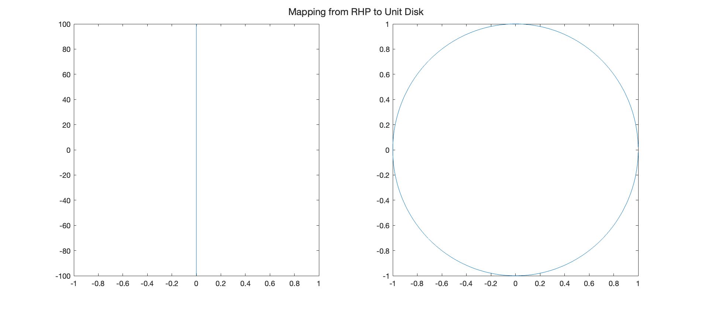

## About
Quick and easy function to graph conformal mapping to visualize specific lines. You can plot any number of lines
and pass them through the function that you want. 
Here's an example transformation - the code for this example is in exampleScript.m.

